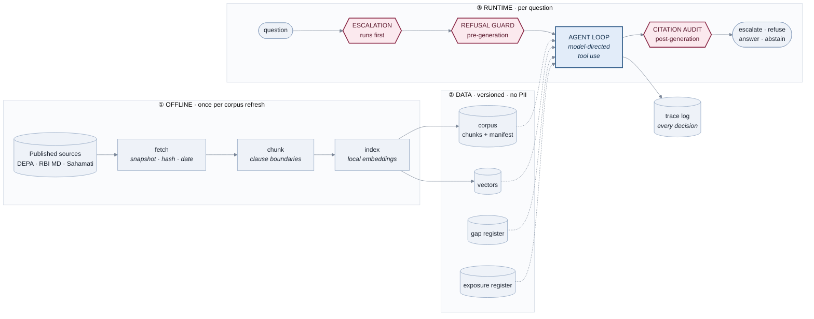
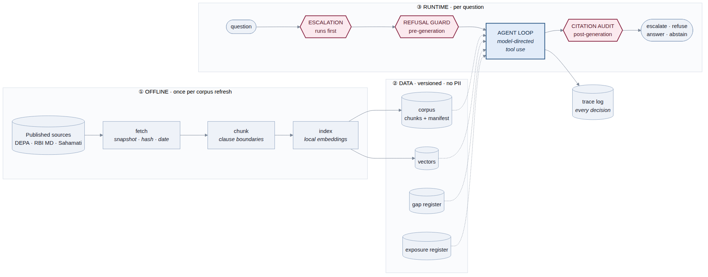
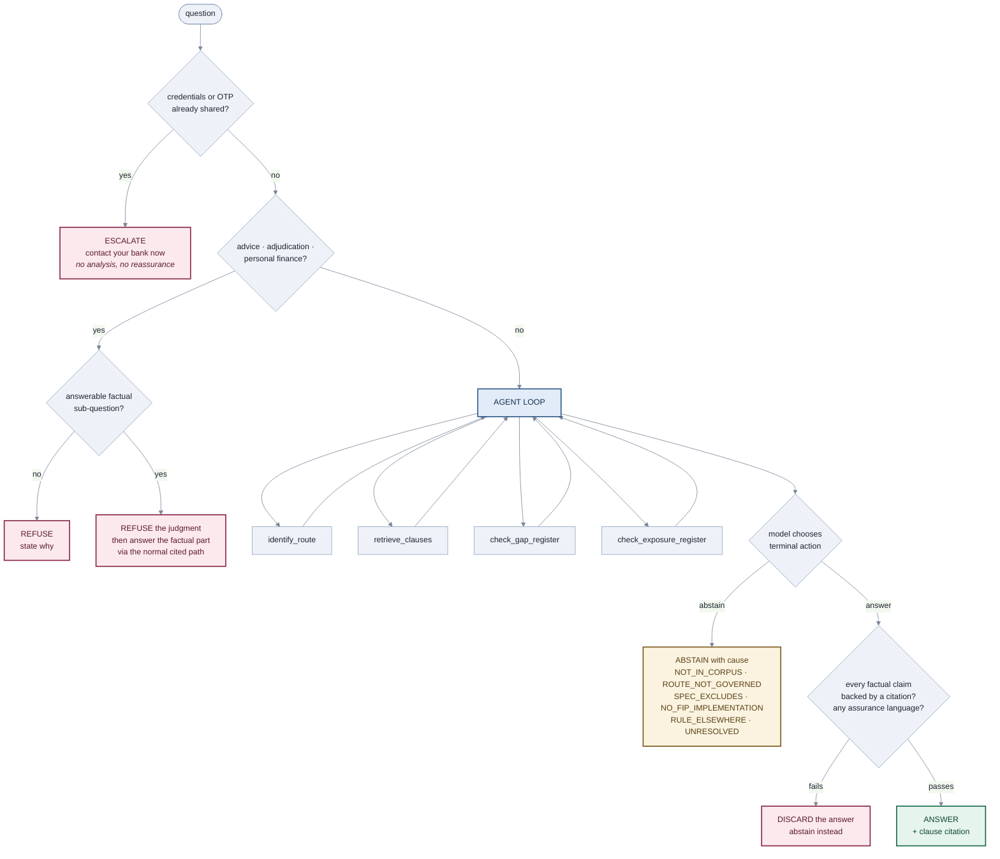

# Consent Lens — System Architecture

**v0.1 · 20 August 2026 · companion to PRD v0.4**

This document exists so every technology claim made about Consent Lens can be pointed at a
specific component. Where a fashionable technique is *not* used, that is stated and reasoned
rather than left ambiguous.

---

## 1. Technology claims — what is actually true

Read this table before the diagrams. It is the honest answer to "what did you build?"

| Claim | Verdict | Where, precisely |
|---|---|---|
| **Retrieval-Augmented Generation (RAG)** | **Yes — core** | Ingestion → clause chunking → local embedding → cosine retrieval with a similarity floor → retrieved clauses injected as tool output → generation constrained to them → post-generation citation audit. §4. |
| **Agentic** | **Yes, but narrowly — a single-agent tool-use loop** | The model selects which tools to call, in what order, with what arguments; sequences them (route result shapes the retrieval query); may re-retrieve; and chooses its own terminal action (`answer` vs `abstain`). §5. |
| **Multi-agent / planner / reflection** | **No** | No decomposition module, no critic, no delegation, no persistent memory. Claiming otherwise would be an overclaim. §5.2. |
| **MCP (Model Context Protocol)** | **No, in P0 — and for a reason** | Tools are in-process Python functions exposed via the Anthropic tool-use API. MCP is a *transport* for making tools portable across clients and processes; this is a single-user CLI, so it would add a layer with no benefit. §6. Optional P1: expose Consent Lens *as* an MCP server, which is a real use of MCP rather than a decorative one. |
| **Vector database** | **No, deliberately** | A few hundred clauses. A normalised matrix and a dot product is the correct tool at this size, and it keeps every step explainable. §7. |
| **RAG framework (LangChain / LlamaIndex)** | **No, deliberately** | PRD NFR-1 requires every layer be explainable to a hands-on technologist. A framework that hides the retrieval step trades that away for convenience this build does not need. §7. |
| **Fine-tuning** | **No** | The RBI Master Direction is amended. Answers must be traceable to a *current* clause, which is the whole argument for retrieval over weights. |

### The design principle underneath all of it

> **Agency is confined to reasoning. Every safety-relevant decision is deterministic.**

The escalation path, the refusal guard, the citation audit and the similarity floor are plain
code. The model cannot reach them, cannot argue with them, and cannot be prompted around them.
What the model *is* trusted with is deciding which evidence to gather and whether the evidence
suffices — which is exactly what a language model is good at, and exactly what a regex is not.

This is the inverse of the common pattern of handing safety to the agent's judgment.

---

## 2. System architecture

**Red = deterministic code. Blue = the model.** That colour split is the architecture.

---

## 3. Request lifecycle — every branch

**Precedence is strict: escalation > refusal > answer.** Safety outranks the boundary; the
boundary outranks helpfulness. The first two gates are evaluated before the model sees the
question at all — an evaluative question is never handed to the generator as something to answer.

---

## 4. Where the RAG is

| Stage | What happens | Non-standard choice, and why |
|---|---|---|
| **Ingest** | Fetch each source, store with SHA, byte count and UTC retrieval date | A citation without an as-of date is unverifiable once the Master Direction is amended — which is the argument for RAG over fine-tuning, so it has to hold |
| **Chunk** | Split on clause/section boundaries; carry a human-lookup-able clause id and the source's **authority** (regulation / specification / SRO guidance) | **Not fixed token windows.** The promise is "the spec says X, in clause Y" — a citation pointing at half a clause is not a citation. Authority is carried per chunk so SRO guidance is never rendered as regulation |
| **Embed** | Local sentence-transformer, L2-normalised, stored as a numpy array | Runs on the laptop; no key needed to inspect retrieval. Only generation calls out |
| **Retrieve** | Cosine similarity, **similarity floor applied before top-k** | The floor matters more than k. Returning the five least-bad chunks for an uncovered question is precisely how a RAG system produces a confident wrong answer. Below the floor we return nothing and the agent abstains |
| **Generate** | Retrieved clauses arrive as tool output; generation constrained to them | |
| **Verify** | **Post-generation audit in code:** every factual sentence must map to a citation, and no answer may contain assurance language | Standard RAG stops at generation. This build treats an uncited answer as a defect to catch, not a prompt to tune |

---

## 5. Where the agentic behaviour is — and where it stops

### 5.1 What the model actually decides

Five tools; the model picks, orders and parameterises them, and picks its own exit.

| Tool | Returns | Read/write |
|---|---|---|
| `identify_route` | AA / eCAS / PDF upload / credential sharing / unknown, and whether governed | read |
| `retrieve_clauses` | Clauses above the similarity floor, with citations | read |
| `check_gap_register` | Whether this is a known framework gap, and its cause attribution | read |
| `check_exposure_register` | What the shared artefact structurally enables and does not | read |
| `answer` / `abstain` | Terminal actions | — |

**The agentic operations, named plainly:**

1. **Tool selection** — nothing forces `identify_route` to run. The model calls it when the question describes an action rather than asking about a rule.
2. **Sequencing with dependency** — the route result changes the retrieval query. "What protects me?" retrieves differently once the route is known to be eCAS rather than AA.
3. **Iteration** — the model may retrieve again with a refined query when the first result is thin, bounded by `max_turns`.
4. **Terminal judgment** — deciding that retrieved evidence is *insufficient* and calling `abstain` rather than assembling a plausible answer. This is the one genuinely hard call in the system, and it is the one deliberately given to the model, because no rule expresses it well.

That is **Level 1 agency: a tool-use loop.** It is real, and it is the honest ceiling of the claim.

### 5.2 What it is not — state this before someone else does

| | Present? |
|---|---|
| Planner / task decomposition before acting | No |
| Self-critique or reflection loop | No |
| Multiple specialised agents, delegation | No |
| Persistent memory across sessions | No |
| Autonomous long-horizon operation | No |
| Any action that mutates state outside the trace log | No — every tool is read-only |

**All five tools are read-only.** Consent Lens cannot revoke a consent, contact a bank, or
change anything. It reads and explains. Given that it advises people about financial exposure,
having no write capability at all is a design choice worth naming, not an omission.

### 5.3 What is deliberately kept away from the model

Escalation check · refusal classification · similarity floor · citation audit · assurance-language
check · the two registers.

An agent that can be talked out of refusing is not a guard. If the refusal boundary were a
model judgment, the boundary would be exactly as reliable as the prompt — and the whole claim
of the product is that it is not.

---

## 6. MCP — not used, and why that is the right answer

MCP standardises how a model reaches tools **across process and application boundaries**. It
earns its place when the same tools must serve multiple clients, run out-of-process, or be
distributed to people who did not write them.

None of that is true here. Consent Lens is a single-user CLI whose tools are functions in the
same process. Adding MCP would introduce a transport layer, a server lifecycle and a failure
mode, in exchange for nothing — and it would violate NFR-1 by putting indirection between the
reader and the retrieval step.

**Knowing when not to reach for a technology is the same skill as knowing when to.**

**The honest P1 case for MCP:** wrap the retrieval and guard as an MCP server, so Consent Lens
becomes available inside any MCP client — a person could ask these questions from their normal
assistant instead of a terminal. That is a real use (portability), not decoration. It is a
stretch item; the guard would have to be enforced server-side, since a client cannot be trusted
to honour it.

---

## 7. What was deliberately not used

| Not used | Why |
|---|---|
| Vector database (FAISS, Chroma, pgvector) | A few hundred clauses. A dot product over a normalised matrix is correct at this size and adds no operational surface. Revisit at ~10⁵ chunks |
| RAG framework | NFR-1 outranks convenience. Every layer must be explainable without appealing to what the framework does internally |
| Reranker | Would likely help. Cut for time, and the similarity floor does the load-bearing work of refusing to answer |
| Hybrid / BM25 retrieval | Would likely help on exact clause-number lookups. Logged as known future work rather than pretended away |
| Fine-tuning | Regulation is amended; answers must trace to a current clause |
| Streaming / async | No user-facing latency requirement in a post-consent, self-initiated moment |

---

## 8. Data stores

| Store | Contents | Authority | Notes |
|---|---|---|---|
| `corpus/` | Snapshotted source documents + manifest (hash, retrieval date) | regulation / specification / SRO guidance, **per chunk** | Read-only. Committed, so citations stay verifiable |
| `vectors.npy` | Embeddings | — | Rebuildable; not committed |
| Gap register | Known framework/implementation gaps, with cause and verification status | **curated product data, not corpus** | Unverified entries surface to the user as unresolved, never asserted |
| Exposure register | What each artefact structurally enables | **curated product data, not corpus** | Capability claims only. Never assurance, never likelihood |
| `logs/traces/` | Every guard decision and tool call, per query | — | No third-party PII. Public artefact |

**Register claims must never be rendered as regulatory citations.** They are the author's
curated assessments, marked as such. Conflating them with cited regulation would break the one
discipline the product is selling.

---

## 9. Explaining this in ten sentences

1. It answers "what did I share and what protects me" from the published DEPA and RBI documents, and cites the clause for every claim.
2. It is RAG: clause-boundary chunking, local embeddings, cosine retrieval with a similarity floor, generation constrained to what was retrieved.
3. The chunking follows clauses rather than token windows, because a citation to half a clause isn't a citation.
4. The similarity floor is the important parameter — below it we return nothing, because the alternative is a confident answer to a question the corpus doesn't cover.
5. It is agentic in one specific sense: a single-agent tool-use loop where the model chooses which of five read-only tools to call, in what order, and when to stop.
6. It is not multi-agent, has no planner, no reflection loop and no memory — I'd rather name the ceiling than have someone find it.
7. Every safety-relevant decision is deterministic code, not model judgment: escalation, refusal, the similarity floor, and the post-generation citation audit.
8. That's the inversion — agency for reasoning, determinism for safety. An agent that can be talked out of refusing isn't a guard.
9. MCP isn't used, because the tools are in-process functions serving one CLI; MCP is a portability transport and there's nothing here to make portable yet.
10. Every run writes a trace, so the claim that the boundary is enforced in code is a transcript rather than an assertion.
